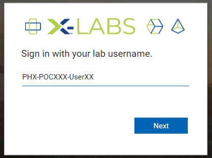
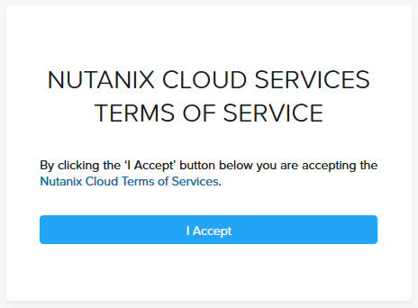
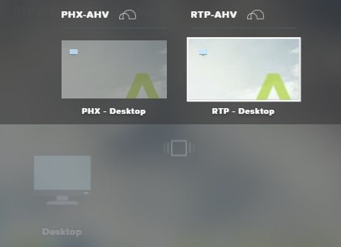
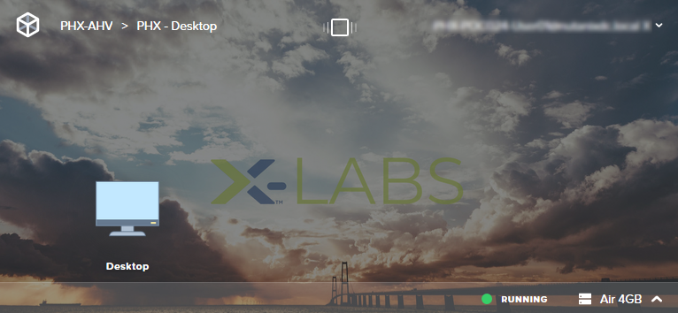
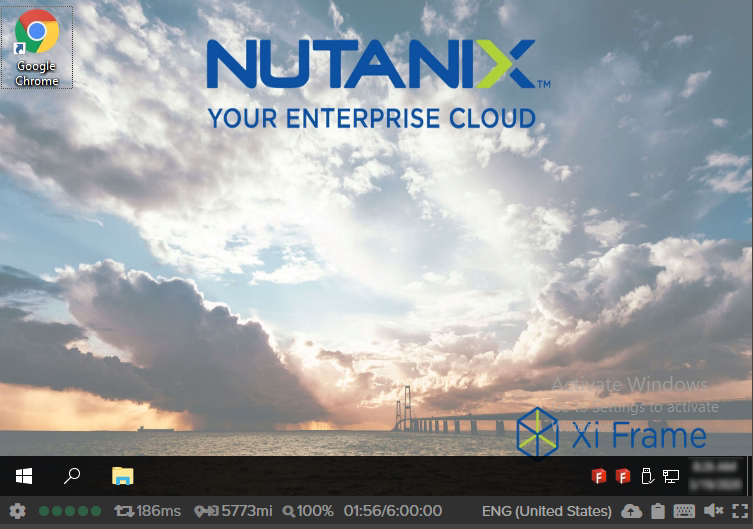
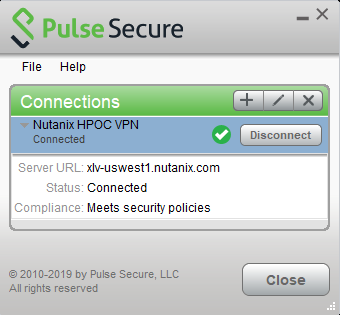

.. _clusteraccess:

-----------------------
Zugang zur Lab Umgebung
-----------------------

Zugangs Übersicht
+++++++++++++++++

Die Lab Umgebung stehen physisch in der USA. Um auf diese zugreifen zu können wird ein Remote Zugriff benötigt. Hierfür stehen 3 Optionen zur Auswahl: **Nutanix Frame VDI**, **Pulse VPN** *oder* **Parallel VDI Zugang.**

Die Nutanix Datacenter stehen i.d.R. in einem von 2 unterschiedlichen Datacentern in der USA welches Sie an Ihrer VPN Benutzerkennung erkennen können: **PHX** = Phoenix Datacenter in Arizona oder **RTP** = Durham Datacenter in North Carolina. Je nach Verbindungsart müssen Sie ggf. Datacenter spezifische Verbindungsparameter verwenden.

Frame VDI Client
++++++++++++++++

.. note::
   Die Nutanix Frame VDI Lösung ist i.d.R. der einfachste und unkomplizierteste Weg auf die Umgebung zuzugreifen. Hierfür wird eine VDI Session mittels des Browsers aufgebaut ohne, dass etwas auf Ihren Rechner installiert werden muss. Beachten Sie aber Bitte, dass Frame eine VDI Session innerhalb ihres Browsers aufbaut, sprich schließen Sie den Browser oder den Tab ist die Session auch beendet. Für ein optimiertes Nutzererlebnis wird Google Chrome oder Mozilla Firefox als Browser empfohlen.

1. Melden Sie sich auf folgende Website mit Ihren Zugangsdaten an: https://frame.nutanix.com/x/labs

2. Akzeptieren Sie ggf. die "Terms of Service".

3. Danach landen Sie auf dem Frame Launchpad und können sie mit dem VDI Desktop verbinden. Abhängig davon ob Ihr HPoC in einem RTP oder PHX Datacenter steht müssen Sie ggf noch das Launchpad wechseln. Klicken Sie dafür oben mittig auf das kleine Symbol und wählen das passendene Desktop Lauchpad aus.

4. Danach können Sie durch klick auf das Desktop Symbol zu Ihrem VDI Desktop gelangen.

4. Wie Sie sehen können, landen Sie nun auf einem Windows basiertem Desktop von welchem aus Sie mittels Chrome oder Firefox auf die Umgebung zugreifen können.

Pulse Secure VPN Client
+++++++++++++++++++++++

.. note::
   Um den VPN Zugang zu nutzen muss ein VPN Client installiert werden, dafür werden Administrator Rechte auf Ihrem Laptop benötigt.

1.	Falls der Client bereits installiert ist bitte zu  Schritt 5 springen.
2.	Um den Client herunter zu laden bitte an folgender Website unter Verwendung der bereitgestellten Zugangsdaten anmelden: 
- **PHX** = https://xlv-uswest1.nutanix.com oder 
- **RTP** = https://xlv-useast1.nutanix.com 

    .. figure:: images/pulsewebsite.png

3.	Klicken Sie auf **Start** um den VPN Client herunterzuladen und zu installieren.

    .. figure:: images/pulsedownload.png

4.	Nachdem der Client installiert wurde, können Sie sich von der Web GUI abmelden.

5.	Lokal installierten Client öffnen und eine neue Verbindung mit folgenden Parametern für PHX oder RTP hinzufügen:

- **Type**: "Policy Secure (UAC) or Connection Server (VPN)""
- **Name**: Nutanix HPOC VPN 
- **Server URL für PHX**: https://xlv-uswest1.nutanix.com
- **Server URL für RTP**: https://xlv-useast1.nutanix.com

6.	Sobald der Client eingerichtet ist mit den bereitgestellten Zugangsdaten verbinden.

Parallels VDI Zugang
++++++++++++++++++++

.. note::
  Die deutlich empfohlene Lösung um auf die HPoC Umgebung zuzugreifen ist die Frame VDI oder Pulse VPN Verbindung, da die Parallel VDI Verbindung i.d.R. deutlich langsamer ist. Für die Fälle in denen aufgrund diverser Gründe (u.a. fehlende lokale Admin Rechte) keine Pulse VPN Verbindung möglich ist, besteht alternativ noch die Option mittels Parallel VDI auf die Umgebung (u.a. auch ohne Installation eines lokalen Clients) zuzugreifen.

1.	Unter Verwendung der bereitgestellten Zugangsdaten bitte an folgender Website anmelden: https://xld-uswest1.nutanix.com (für PHX) oder https://xld-useast1.nutanix.com (für RTP)

   .. figure:: images/parallel-website.png

2.	Sobald angemeldet wird Ihnen angezeigt, dass Sie derzeit noch keine Anwendung installiert haben ("no Applications Found"). Danach beginnt automatisch oder manuell die Identifizierung ob bei Ihnen eine Parallel Client Installation vorhanden ist:

   .. figure:: images/parallel-dedecting.png

3. Falls noch kein Client installiert ist, haben Sie nun die Option einen Parallel Client zu installieren (**Achtung: lokale Installationsrecht erforderlich**) oder den HTML5 WebClient ohne zusätzliche Installation zu verwenden. 

    .. figure:: images/parallel-client-detecting.png

4. Danach taucht auf der Parallel Website der für Sie bereitgestellte VDI Desktop auf - nun können Sie sich mit diesem verbinden:

  .. figure:: images/parallel-connectionapp.png

5.	Danach gelangen Sie (je nach Parallel Client Option) im Browser oder auch in der Parallel Client App auf dem VDI Desktop mit Zugang zu Ihrer HPoC Umgebung:

  .. figure:: images/parallel-vdidesktop.png