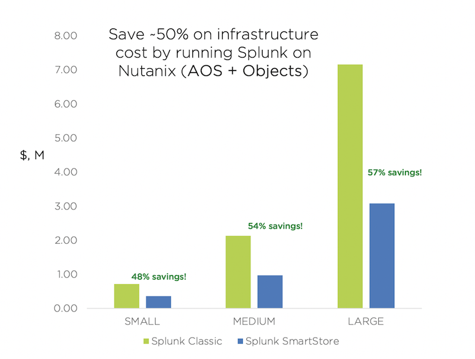
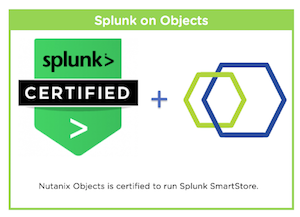
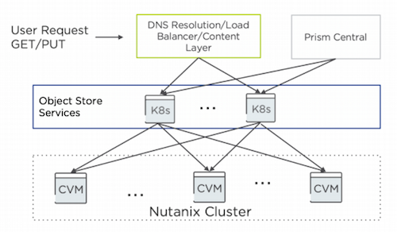

.. _objects_splunk:

-------------------------------------
Splunk and Objects Overview
-------------------------------------

Historically, deploying Splunk on traditional infrastructure proved a difficult task, both in correctly sizing storage for Hot and Cold tiers and in trying to keep costs reasonable.
With the introduction of Splunk SmartStore, Splunk can offload warm and cold storage to a low cost remote store, such as S3-compatible Object storage.

Nutanix Objects is a fully S3-compatible Object store, and is fully compliant with the Amazon AWS S3 HTTP REST API, so it can be utilized by Splunk's SmartStore natively. Nutanix Objects can be deployed in a dedicated cluster
(known as Objects Dedicated) or on an existing HCI Cluster (known as Objects for AOS)

Nutanix Objects takes over the responsibility for maintaining high availability of the data and cold storage capacity requirements can be reduced, offering a large TCO improvement, as indicated in the figure below:

Splunk workloads benefit from a number of key features of the Nutanix platform, including:

- Predictive Performance and flexible scaling of Nutanix's and Nutanix Objects' Scale Out Architecture
- High-performance of Nutanix Distributed Storage Fabric (DSF) to handle Splunk's demanding I/O requirements
- One-click provisioning capability within Prism to deploy VMs and Object Storage for Splunk
- Minimized costs with Nutanix's ability to leverage storage dense hybrid nodes for Objects
- Secured end-to-end data-at-rest encryption for all storage tiers

Lab Setup
+++++++++

This lab requires both the :ref:`windows_tools_vm` and :ref:`linux_tools_vm` VMs.

If you have not yet deployed these VMs, see the linked steps before proceeding with the lab.

Nutanix Objects
++++++++++++++++++

Nutanix Objects integrates with the solution stack through services that run inside the Prism
Central VM and manage all the other components and services of object storage. The Nutanix
cluster deploys VMs to handle the multiple components that provide the object storage API and
lookups for the objects. These components run as containerized services in a Kubernetes cluster.

Objects follows a modular and scale-out design where each component focuses on a single core
function, so you can scale out any component independently to match the workload demands

When users of Objects make GET and PUT requests to their object storage endpoint, they first
hit the front-end adapter, a native, built-in load balancer that manages the S3 REST API calls and
serves them to the right worker. The worker VM runs different services, including:

- An object controller service, which oversees the data management layer that interfaces with AOS and coordinates with the metadata service.
- A metadata service that manages the metadata and serves as a general key-value store that also handles partitioning and region mapping.
- A life cycle management service that controls life cycle, audits, and background maintenance activities.
- An identity and access management service that handles user authentication for accessing buckets.

You can deploy Nutanix Objects in an existing cluster for a share of the overall available cluster
storage. You can also deploy it in a cluster created solely for object storage purposes. The choice
depends on the use case and resources available to fit the deployment demands and needs

Create Nutanix Objects IAM User Keys
------------------------------------

Before we deploy Splunk on our Nutanix Cluster, let's explore Nutanix Objects from within Prism Central, which we'll later leverage in the Splunk SmartStore.

To save time, we have pre-deployed an Object Store (named objectstore) on this cluster.
In order for Splunk to communicate with Nutanix Objects, you'll need to create a set of API Keys.

#. In **Prism Central** > select :fa:`bars` **> Services > Objects**.

   .. figure:: images/2.png

#. Click on **Access Keys > Add People > Add People not in a directory service**.

   Enter in an email address that is unique (it does not need to be able to receive email).

   .. figure:: images/3.png

#. Click on **Download Keys**. Depending on your browser, it will either open a new tab or download a text file.

   .. note::

      It is important you save the **Access Key** and **Secret Access Key** as it will only be shown once.

   .. figure:: images/5.png

   .. figure:: images/4.png

Create Bucket Using IAM User
------------------------------------
Since Object Storage uses API keys to grant access to various buckets, we'll want to create a bucket using the API key we just created above.
A bucket is a sub-repository within an object store which can have policies applied to it, such as versioning, WORM, etc. By default a newly created bucket is a private resource to the creator. The creator of the bucket by default has read/write permissions, and can grant permissions to other users.

#. Click on your Object Store then click **Create Bucket**

   .. figure:: images/buckets-1.png

#. Name the bucket *INITIALS*-**bucket** > click **Create**

   .. note::

     Bucket names must be lower case and only contain letters, numbers, periods and hyphens.
     Additionally, all bucket names must be unique within a given Object Store. Note that if you try to create a folder with an existing bucket name (e.g. *your-name*-my-bucket), creation of the folder will not succeed.
     Creating a bucket in this fashion allows for self-service for entitled users, and is no different than a bucket created via the Prism Buckets UI.

   .. figure:: images/buckets-2.png

#. Click on the bucket you just created, then click **Edit User Access**

   .. figure:: images/buckets-3.png

   .. figure:: images/buckets-4.png

#. Find your user and give it **Read and Write** access

   .. figure:: images/buckets-5.png
